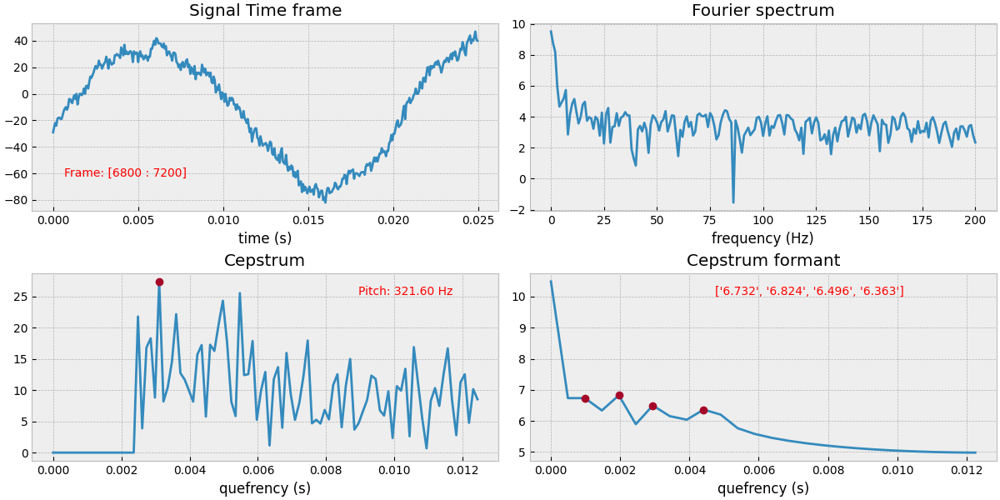

# Pitch and Formant detector


Detect pitch and formant frequency in a wav file with cepstrum

## Summary
1. Change the `filename` to your wav file
2. Select the desired frame for pitch extraction
3. That's it!

<br>

## Pitch 
Pitch is the fundamental frequency of a harmonic signal. Our ears sense musical pitch even in the presence of noisy signals; we can follow several pitches simultaneously and also detect slight but expressive pitch deviations. [more](https://en.wikipedia.org/wiki/Pitch_detection_algorithm)

## Formant
In speech science and phonetics, a formant is the broad spectral maximum that results from an acoustic resonance of the human vocal tract. [(more)](https://en.wikipedia.org/wiki/Formant)

<br>

## Algorithm

### Cepstrum
Cepstrum is the result of computing the inverse Fourier transform (IFT) of the logarithm of the estimated signal spectrum. Which is very helpful on finding signal properties such as pitch frequency. 


## Installation
This project uses ```numpy```, ```scipy```, and ```matplotlib```.
If you don't have them installed, it will automatically install them.

For this you must have [Python](http://python.org/) installed.

## Result
The algorithm detects the pitch and formant frequecies and shows them with their value on the selected frame.




## Author
 [Parsa Mazaheri](https://github.com/parsa-mz)
